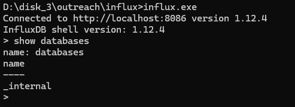
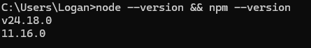
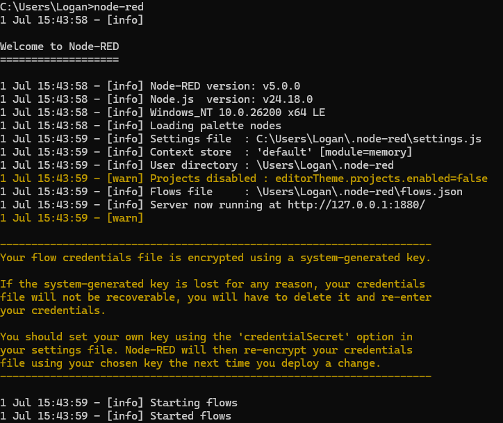
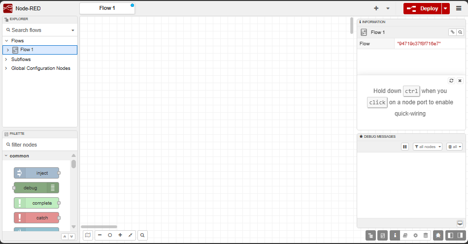
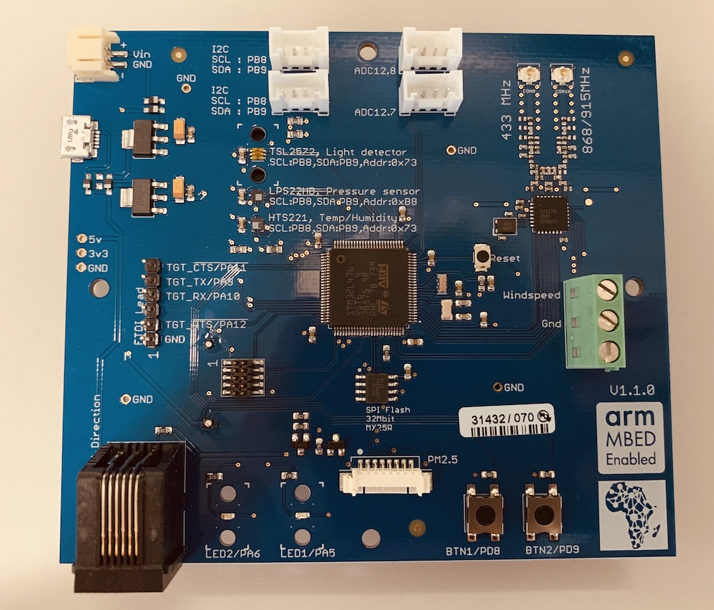
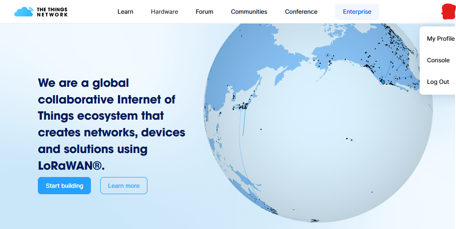
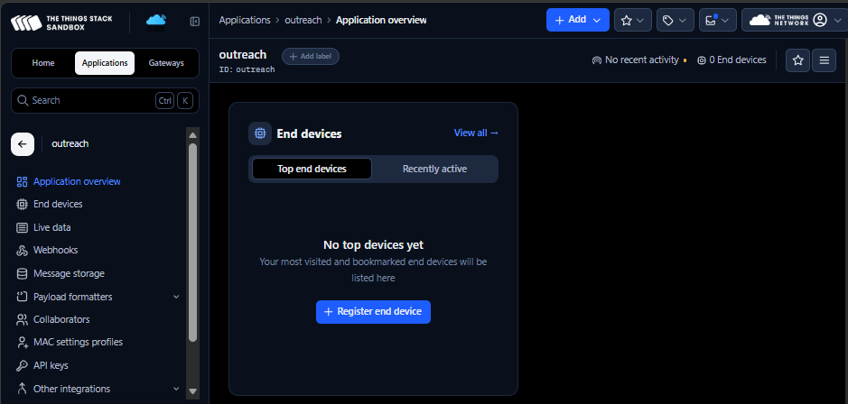

# Practical Session: Farewell to MbedOS

##  LoRaWAN and The Things Network.
In this practical session we will look into what Realtime operating systems (RTOS) are and the benefits. Also, we will utilize the Mbed platform to program a microcontroller on a test board and get some data. For data transmission we will utilize the LoRaWAN and the test board will be registered on The Things Network (TTN). From TTN we will utilize NodeRed to transfer data from a TTN application to an Influx timeseries database for permanent storage.

### Requirements for the Interactive Sessions 
Please download and install these tools.

1. Download and install *Tera Term*. Link: **[TeraTerm Link](https://github.com/TeraTermProject/teraterm/releases/download/v5.6.1/teraterm-5.6.1-x64.exe)**.
2. Download *Influxdb zip folder* from the following link. Link: **[InfluxDB](https://dl.influxdata.com/influxdb/releases/v1.12.4/influxdb-1.12.4-windows_amd64.zip)**.
    - Create a desktop folder - `influx`
    - Unzip the downloaded zip into this folder
    - To check whether the download is working, double click the `influxd.exe` and leave it running 
    - Using your command prompt, navigate into the influx folder with all the contents and run `influx.exe`
    - Next command `show databases`
    - The output should be similar to Figure 1.

    |  | 
    |:--:| 
    | *Figure 1: Influx Output 1* |

    - To create a database for the session run `create database outreach_2026`
    - Run `show databases` again to check whether the database was created.
3. Download and Install *NodeRed* using the following steps.
    - Install `Node.js` - Download the latest LTS version of Node.js from the official Node.js home page. Link: **[Node](https://nodejs.org/dist/v24.18.0/node-v24.18.0-x64.msi)**.
    - Run the downloaded MSI file
    - Once installed, open a command prompt and run the following command to ensure *Node.js* and *npm* are installed correctly. Command: `node --version && npm --version`
    - Thwe output should as shown on Figure 2.

    |  | 
    |:--:| 
    | *Figure 2: NodeRed Output* |

    - Install Node-RED: Run the following command: `npm install -g node-red`
    - To run Node-RED: `node-red`
    - The output should be as shown on Figure 3.

    |  | 
    |:--:| 
    | *Figure 3: NodeRed Output when running* |

    - To use NodeRed, run the local server link on your favourite browser: `http://***.*.*.*:1880`
    - Figure 4, shows the output.

    |  | 
    |:--:| 
    | *Figure 4: NodeRed Terminal* |

Please create accounts for the following.
1. **The Things Network**
     An IoT (Internet of Things) system can be broadly divided into 3 main layers. The first layer is the perception layer which includes sensors and actuators involved in data collection. The second layer is the network layer which is responsible for communication between devices in the system. The network layer includes elements such as gateways and network servers. The last layer is the application layer, where an end user gets to interact with data output.
     The network server under the network layer is a crucial component in a deployment scenario. The network server is a central element and is in charge of management of gateways, the authorization of end nodes and the exchange of data (uplink and downlink) between the sensor node and the user application.
     The Things Network is a free LoRaWAN network server that is open to all. It has popularized the LoRaWAN technology by offering free services to IoT enthusiasts especially during initial tests before professional deployments.

     To open a TTN account we are going to follow the steps in following link: Link: **[The Things Network Account](https://dekut-dsail.github.io/tutorials/tutorial-water-resource/tp2.html)**.
2. **ARM Keil Studio**
    Keil Studio Cloud is a web based IDE that allows for the creation, running and debugging of embedded applications. It runs ARM Mbed OS which is an open source operating system for microcontrollers. It is a great tool for beginners as it does not require any installation and is very easy to use.

    To Open an account click on the following link select the `classic` option and move on from there: Link **[ARM Keil Studio](https://studio.keil.arm.com/auth/login)**.

## Hardware Section.

For this practical session, We are going to utilize the DSA 2019 board (Environmental Sensor Board) shown on Figure 5.

|  | 
|:--:| 
|*Figure 5: DSA 2019 Environmental Sensors Board*|

To set it up, we are going to follow the procedure provided in the following link: **[DSA 2019 board (Environmental Sensor Board)](https://github.com/janjongboom/dsa-firmware-2019)**.
The item to change on the procedure is the compiler. Instead of using the **MbedCLI**, we are going to utilize the **[ARM Keil Studio](https://studio.keil.arm.com/auth/login)**

## NodeRed Setup Section 
Node-RED is a flow-based, low-code development platform that allows users to visually create applications by connecting nodes for data collection, processing, and automation.
- To run NodeRed (Already installed), open your **command prompt** and run the the node red command `node-red`
- Copy and paste the localhost link provided on your browser and run it `http://***.*.*.*:1880`
- After running the link, NodeRed will open, ready for use 

## Scraping Data from The Things Network (TTN).

At this level, you already have a TTN account so go ahead and create a TTN application using the steps below
- On the console page click on `create an application.`
- Since this is the first application you will create, you will be forwarded to `create application page.`
- Under creating an application, you will be prompted to provide an application ID. Use the ID `outreach`. The same can apply to application name and description.
- Click on `create application.`
- After creation you will be able to access the application as shown on Figure 7.

|  | 
|:--:| 
|*Figure 6: TTN console when you are login in for the first time*|

|  | 
|:--:| 
|*Figure 5: DSA 2019 Environmental Sensors Board*|

From this point, the steps to register the board and to get the data on NodeRed will be provided verbally by the instructor.

## Setting up the Influxdb
- To run the influx, navigate to you already-downloaded influx folder and double click on the `influxd.exe` and leave it running 
- Open another command prompt terminal, navigate to the same folder and run `influx.exe`
- Next command `show databases`. This will show you the databases present
- The `outreach_2026` database should be there. Leave the terminal Running 
- From this point foward, the integration steps on NodeRed will be provided by the instructor. 

## **END**